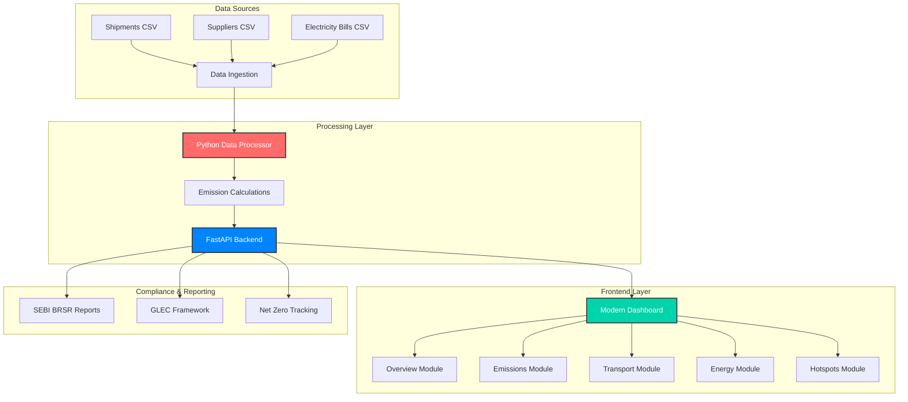

# 🌱 CarbonIntel - Carbon Intelligence Platform (India-first) 

[](https://opensource.org/licenses/MIT)
[](https://www.python.org/downloads/)
[](https://fastapi.tiangolo.com/)
[](https://nextjs.org/)

**Real-time Carbon Footprint Monitoring & ESG Compliance Platform** designed specifically for Indian supply chains with automated regulatory reporting (SEBI BRSR, GLEC Framework compliance).

## ✨ Key Features

### 🎯 **Real-time Carbon Monitoring**
- **Live Dashboard** with automatic data refresh (2s intervals)
- **Multi-scope Emissions** tracking (Scope 1, 2, and 3)
- **Transport Intelligence** across road, rail, air, and sea modes
- **Energy Consumption** monitoring with renewable energy tracking
- **Emission Hotspots** identification for optimization

### 📊 **Modern Dashboard Experience**
- **Glassmorphism UI** with dark theme and smooth animations
- **Interactive Charts** powered by Plotly.js with real-time updates
- **Responsive Design** optimized for desktop, tablet, and mobile
- **Smart Tooltips** with module-specific functionality information
- **Regulatory Info Modal** with government standards and compliance details

### 🏛️ **Regulatory Compliance**
- **SEBI BRSR** (Business Responsibility and Sustainability Reporting) ready
- **GLEC Framework** v3.2 compliant for logistics emissions
- **India Net Zero 2070** target tracking and progress monitoring
- **Automated ESG Reporting** with audit-ready outputs

### ⚡ **Real-time Data Processing**
- **CSV Stream Processing** with automatic data ingestion
- **Incremental Computation** using Pathway framework
- **Live Data Simulation** for continuous monitoring
- **API-driven Architecture** with FastAPI backend

## 🏗️ Architecture Overview



## 🚀 Quick Start

### Prerequisites
- **Python 3.11+**
- **Node.js 18+** (for development)
- **Git**

### 1️⃣ Clone Repository
```bash
git clone https://github.com/vijayshreepathak/CarbonCalc.git
cd CarbonCalc/carbon-intel-platform
```

### 2️⃣ Set Up Virtual Environment
```bash
# Create virtual environment
python -m venv carbon_env

# Activate (Windows)
carbon_env\Scripts\activate

# Activate (macOS/Linux)
source carbon_env/bin/activate

# Install dependencies
pip install -r requirements_minimal.txt
```

### 3️⃣ Start the Platform
```bash
# Navigate to modern dashboard
cd modern_dashboard

# Start the backend server
python backend.py

# Start data simulation (optional, in another terminal)
python simulate_updates.py
```

### 4️⃣ Access the Dashboard
- **Main Dashboard**: http://localhost:8001
- **API Health**: http://localhost:8001/api/health
- **API Documentation**: http://localhost:8001/docs (when available)

## 📱 Dashboard Modules

### 🏠 **Overview Module**
**Real-time carbon footprint monitoring with comprehensive KPIs**

**Features:**
- Total emissions tracking (32.1M kg CO2e)
- Activity monitoring (3,988 total activities)
- Transport emissions breakdown (11.4M kg CO2e, 35% of total)
- Electricity usage (1.1M kg CO2e, 3% of total)
- Daily emission trends with interactive charts
- Recent activity feed with real-time updates

**Info Tooltip:** *Hover over the (i) button to see detailed functionality*

### 🏭 **Emissions Analysis Module**
**Deep dive into emission sources and regulatory compliance**

**Features:**
- **Scope-wise Breakdown**: Scope 1, 2, and 3 emissions analysis
- **Monthly Trends**: Historical emission patterns and forecasting
- **Source Analysis**: Categorized emission sources with percentages
- **SEBI BRSR Metrics**: Compliance indicators and reporting readiness
- **Benchmarking**: Industry and sectoral comparisons
- **Reduction Tracking**: Progress towards emission reduction targets

### 🚛 **Transport & Logistics Module**
**GLEC Framework compliant transportation emission tracking**

**Features:**
- **Multi-modal Analysis**: Road (45%), Rail (25%), Air (20%), Sea (10%)
- **Route Efficiency**: Performance metrics for transportation lanes
- **Fleet Utilization**: Vehicle capacity and efficiency tracking
- **GLEC Compliance**: ISO 14083 aligned emission factors
- **Distance & Weight**: Comprehensive logistics analytics
- **Supply Chain Mapping**: Upstream and downstream carbon footprint

### ⚡ **Energy Consumption Module**
**Net Zero 2070 aligned energy monitoring and renewable tracking**

**Features:**
- **Real-time Monitoring**: Electricity consumption (2.2M kWh)
- **Renewable Mix**: 12% renewable energy (target: 25%)
- **Peak Analysis**: Usage patterns and optimization opportunities
- **Grid vs. Renewable**: Energy source breakdown with carbon intensity
- **Efficiency Metrics**: kWh per unit production and benchmarking
- **Net Zero Progress**: Alignment with India's 2070 carbon neutrality goals

### 🔥 **Emission Hotspots Module**
**AI-powered identification of high-impact emission sources**

**Features:**
- **Supplier Hotspots**: Top emission-generating suppliers with impact scores
- **Route Analysis**: High-carbon transportation lanes and alternatives
- **Product Impact**: SKU-level carbon intensity and optimization potential
- **Facility Monitoring**: Energy-intensive locations and improvement areas
- **Cost-Benefit Analysis**: ROI calculations for emission reduction initiatives
- **Priority Matrix**: Risk-reward mapping for strategic planning

## 🎨 Design System

### **Modern UI Components**
- **Glassmorphism Effects**: Translucent cards with backdrop blur
- **Dark Theme**: Professional dark mode with accent colors
- **Gradient Accents**: Primary (#00d4aa) and secondary (#0084ff) gradients
- **Smooth Animations**: CSS transitions and transforms for enhanced UX
- **Responsive Grid**: Flexible layouts adapting to all screen sizes

### **Interactive Elements**
- **Info Buttons**: Circular (i) buttons with hover tooltips
- **Smart Modals**: Regulatory information with proper overlay behavior
- **Live Charts**: Real-time updating visualizations with Plotly.js
- **Status Indicators**: System live status with real-time timestamps

## 🔧 API Endpoints

### **Health & Status**
```bash
GET /api/health              # System health check
GET /api/data-status         # Data freshness and statistics
```

### **Carbon Data**
```bash
GET /api/summary             # Complete carbon footprint summary
GET /api/emissions           # Detailed emissions breakdown
GET /api/transport           # Transportation analytics
GET /api/energy              # Energy consumption data
```

### **Static Assets**
```bash
GET /                        # Main dashboard
GET /style.css              # Dashboard styles
GET /app.js                 # Dashboard functionality
```

## 📊 Data Processing Pipeline

### **Input Sources**
1. **Shipments Stream** (`data/streams/shipments_stream.csv`)
   - Transport mode, distance, weight, emission factors
   - Real-time updates every 5-10 seconds
   
2. **Suppliers Stream** (`data/streams/suppliers_stream.csv`)
   - Supplier information, emission factors, updates
   - Periodic updates based on supplier changes
   
3. **Electricity Bills** (`data/streams/electricity_bills_stream.csv`)
   - Energy consumption, grid mix, renewable percentage
   - Monthly billing cycles with real-time monitoring

### **Processing Logic**
```python
# Emission Calculation Examples
transport_emissions = distance * weight * transport_emission_factor
electricity_emissions = kwh * grid_carbon_intensity * (1 - renewable_percentage)
total_footprint = scope1 + scope2 + scope3_transport + scope3_energy
```

## 🏛️ Regulatory Compliance

### **SEBI BRSR (Business Responsibility and Sustainability Reporting)**
- **Framework**: Mandatory ESG reporting for top 1,000 listed entities
- **Coverage**: All 98 essential indicators automated
- **Value Chain**: Scope 3 disclosures for upstream/downstream partners
- **Audit Ready**: Standardized reports with regulatory compliance

### **GLEC Framework v3.2**
- **Standards**: ISO 14083 compliant emission calculations
- **Modes**: Road, rail, air, and sea transportation covered
- **Factors**: India-specific emission factors with global benchmarking
- **Methodology**: Industry-standard greenhouse gas accounting

### **India Net Zero 2070**
- **Target Tracking**: Progress towards carbon neutrality
- **Interim Goals**: 45% carbon intensity reduction by 2030
- **Sector Alignment**: Industry-specific decarbonization pathways
- **Policy Compliance**: Alignment with national climate commitments

## 🔒 Security & Privacy

- **Data Privacy**: No sensitive business data exposed in logs
- **API Security**: Rate limiting and input validation
- **Frontend Security**: XSS protection and CSP headers
- **Environment Variables**: Secure configuration management

## 🚀 Performance Optimization

### **Frontend Optimizations**
- **Lazy Loading**: Charts initialized on-demand per section
- **Efficient Updates**: Only visible components refresh data
- **Memory Management**: Proper cleanup of chart instances
- **CSS Optimization**: Minimal repaints and reflows

### **Backend Optimizations**
- **Static File Serving**: Optimized asset delivery
- **Data Caching**: Intelligent caching of computation results
- **Async Processing**: Non-blocking I/O operations
- **Resource Management**: Efficient memory and CPU usage

## 🧪 Testing

### **Run Tests**
```bash
# Test dashboard functionality
python test_final_simple.py

# Test API endpoints
python test_api.py

# Test tooltip system
python test_tooltip_fix.py

# Test modal functionality
python verify_modal_fix.py
```

### **Testing Coverage**
- ✅ API endpoint functionality
- ✅ Real-time data processing
- ✅ UI component interactions
- ✅ Responsive design behavior
- ✅ Cross-browser compatibility

## 📈 Roadmap

### **Phase 1: Core Platform** ✅
- [x] Real-time dashboard with modern UI
- [x] Multi-module carbon tracking
- [x] Regulatory compliance integration
- [x] Smart tooltip system
- [x] Modal information system

### **Phase 2: Advanced Analytics** 🚧
- [ ] Machine learning emission forecasting
- [ ] Advanced optimization algorithms
- [ ] Supply chain risk assessment
- [ ] Automated report generation

### **Phase 3: Enterprise Features** 📋
- [ ] Multi-tenant architecture
- [ ] Role-based access control
- [ ] Advanced integrations (ERP, IoT)
- [ ] White-label deployment options

## 🤝 Contributing

1. Fork the repository
2. Create your feature branch (`git checkout -b feature/AmazingFeature`)
3. Commit your changes (`git commit -m 'Add some AmazingFeature'`)
4. Push to the branch (`git push origin feature/AmazingFeature`)
5. Open a Pull Request

## 📄 License

This project is licensed under the MIT License - see the [LICENSE](LICENSE) file for details.

## 🙏 Acknowledgments

- **SEBI** for BRSR framework guidelines
- **GLEC** for logistics emission standards
- **Government of India** for Net Zero 2070 commitment
- **Open Source Community** for excellent libraries and tools

## 📞 Support

- **Issues**: [GitHub Issues](https://github.com/vijayshreepathak/CarbonCalc/issues)
- **Discussions**: [GitHub Discussions](https://github.com/vijayshreepathak/CarbonCalc/discussions)
- **Email**: vijayshreepathak@example.com

---

**Made with 💚 for a sustainable future**

*Empowering Indian businesses to achieve carbon neutrality through intelligent monitoring and regulatory compliance.*
