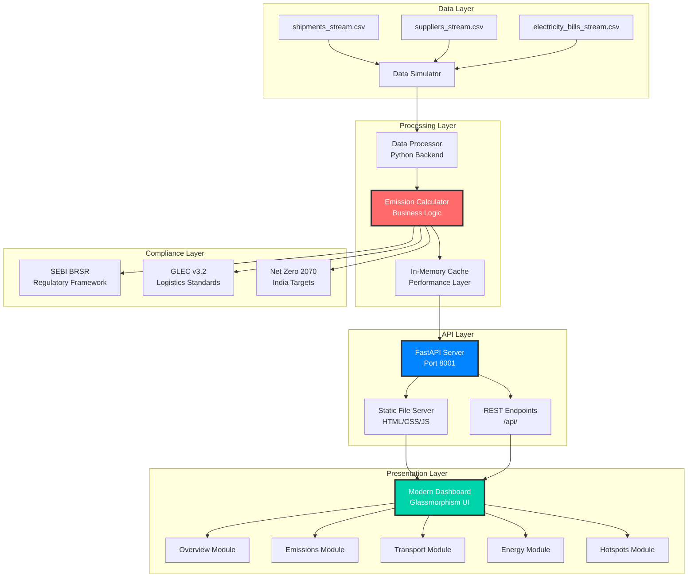
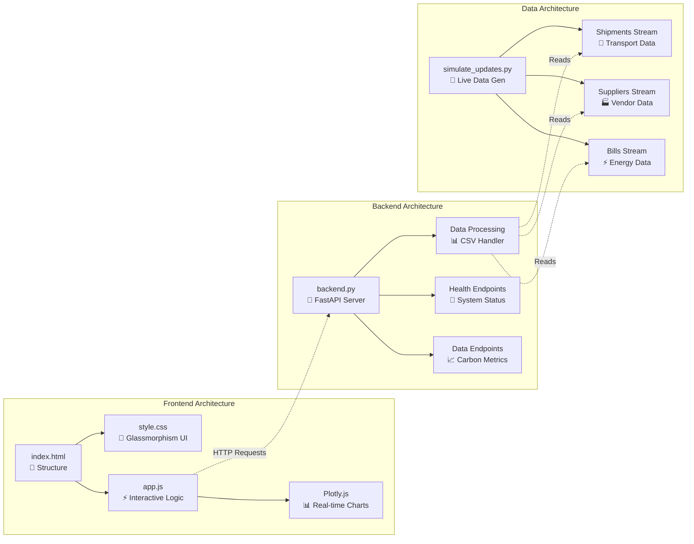
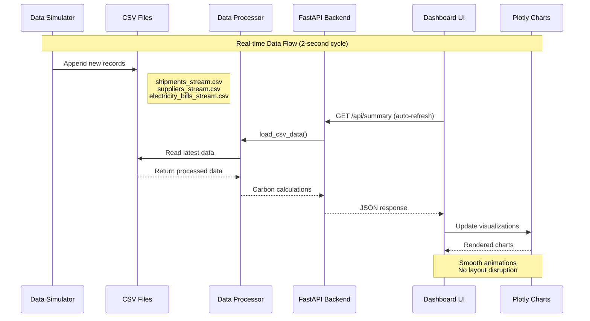
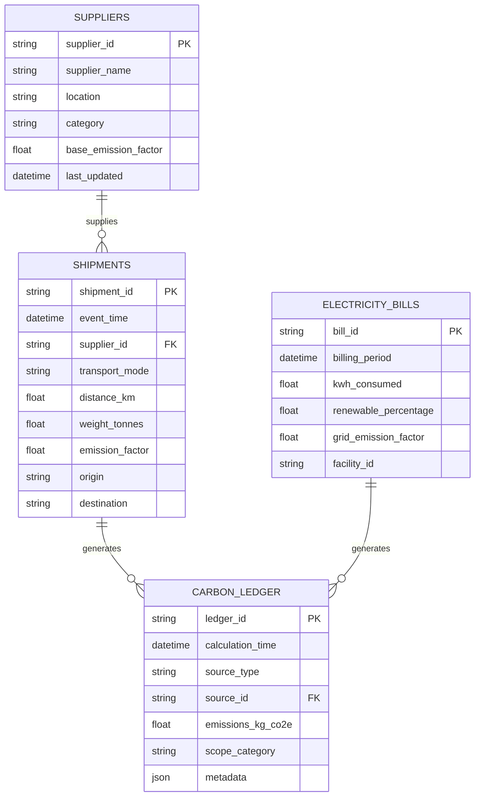
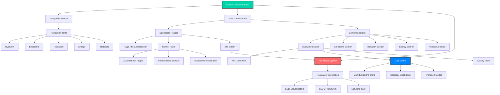

# 🔧 Technical Documentation - Carbon Intelligence Platform

## Table of Contents
1. [System Architecture](#system-architecture)
2. [Technology Stack](#technology-stack)
3. [Component Details](#component-details)
4. [Data Flow Architecture](#data-flow-architecture)
5. [API Specifications](#api-specifications)
6. [Database Schema](#database-schema)
7. [Frontend Architecture](#frontend-architecture)
8. [Deployment Guide](#deployment-guide)
9. [Performance Specifications](#performance-specifications)
10. [Security Implementation](#security-implementation)

---

## 🏗️ System Architecture

### **High-Level Architecture**



### **Detailed System Components**



---

## 💻 Technology Stack

### **Backend Technologies**
| Component | Technology | Version | Purpose |
|-----------|------------|---------|---------|
| **Web Framework** | FastAPI | 0.104.1+ | High-performance async API server |
| **Data Processing** | Pandas | 2.1.4+ | CSV processing and data manipulation |
| **Visualization** | Plotly | 5.17.0+ | Server-side chart generation (future) |
| **HTTP Client** | Requests | 2.31.0+ | API testing and integration |
| **Date Handling** | python-dateutil | 2.8.2+ | Flexible datetime parsing |
| **ASGI Server** | Uvicorn | 0.24.0+ | Production ASGI server |

### **Frontend Technologies**
| Component | Technology | Version | Purpose |
|-----------|------------|---------|---------|
| **Visualization** | Plotly.js | Latest | Interactive real-time charts |
| **UI Framework** | Vanilla JS | ES6+ | Lightweight, fast interactions |
| **Styling** | CSS3 | Latest | Glassmorphism design system |
| **Icons** | Font Awesome | 6.4.0+ | Professional icon library |
| **Fonts** | Inter | Variable | Modern typography system |

### **Development Tools**
| Tool | Purpose | Configuration |
|------|---------|--------------|
| **Python Virtual Env** | Dependency isolation | `python -m venv carbon_env` |
| **Code Formatting** | PEP 8 compliance | Black, isort |
| **Testing** | Quality assurance | Custom test suites |
| **Version Control** | Git | GitHub integration |

---

## 🔧 Component Details

### **1. FastAPI Backend Server (`backend.py`)**

```python
# Core server configuration
app = FastAPI(
    title="Carbon Intelligence Platform",
    description="Real-time carbon footprint monitoring",
    version="2.0.0"
)

# CORS configuration for cross-origin requests
app.add_middleware(
    CORSMiddleware,
    allow_origins=["*"],  # Configure for production
    allow_credentials=True,
    allow_methods=["*"],
    allow_headers=["*"],
    expose_headers=["*"]
)

# Static file serving for dashboard
app.mount("/static", StaticFiles(directory="."), name="static")
```

**Key Features:**
- **Port Configuration**: Runs on port 8001 to avoid conflicts
- **Static Serving**: Direct HTML/CSS/JS delivery
- **API Endpoints**: RESTful carbon data services  
- **CORS Enabled**: Cross-origin resource sharing
- **Health Checks**: System monitoring endpoints

### **2. Data Processing Engine**

```python
def load_csv_data():
    """Load and process real-time CSV streams"""
    
    # Shipments processing
    shipments = pd.read_csv('data/streams/shipments_stream.csv', 
                           skip_blank_lines=True)
    if len(shipments.columns) > 15:
        shipments = shipments.iloc[:, :15]  # Standardize columns
    
    # Flexible datetime parsing
    shipments['event_time'] = pd.to_datetime(
        shipments['event_time'], 
        format='mixed', utc=True, errors='coerce'
    )
    
    # Robust numerical conversion
    numeric_cols = ['distance_km', 'weight_tonnes', 'emission_factor']
    for col in numeric_cols:
        shipments[col] = pd.to_numeric(
            shipments[col], errors='coerce'
        ).fillna(0)
```

**Processing Capabilities:**
- **Real-time CSV Streaming**: Continuous data ingestion
- **Data Validation**: Type checking and error handling
- **Memory Optimization**: Efficient pandas operations
- **Schema Flexibility**: Dynamic column handling

### **3. Modern Dashboard Frontend**

#### **HTML Structure**
```html
<!-- Modular dashboard architecture -->
<div class="app-container">
    <!-- Responsive sidebar navigation -->
    <nav class="sidebar">
        <div class="nav-menu">
            <!-- Module navigation with icons -->
        </div>
    </nav>
    
    <!-- Main content area -->
    <main class="main-content">
        <!-- Dynamic sections -->
        <section id="overview" class="content-section active">
            <!-- Overview module content -->
        </section>
        <!-- Additional modules -->
    </main>
</div>
```

#### **CSS Design System**
```css
/* Glassmorphism design variables */
:root {
    --bg-primary: #0a0f1c;
    --bg-secondary: #1a1f2e;
    --bg-card: rgba(42, 47, 62, 0.8);
    --bg-glass: rgba(255, 255, 255, 0.05);
    --accent-primary: #00d4aa;
    --accent-secondary: #0084ff;
    --border-color: rgba(255, 255, 255, 0.1);
}

/* Modern glassmorphism effects */
.chart-card {
    background: var(--bg-glass);
    backdrop-filter: blur(20px);
    border: 1px solid var(--border-color);
    border-radius: 16px;
    box-shadow: 0 8px 32px rgba(0, 0, 0, 0.3);
}
```

#### **JavaScript Architecture**
```javascript
class CarbonDashboard {
    constructor() {
        this.apiBase = 'http://localhost:8001';
        this.isAutoRefresh = true;
        this.refreshRate = 2000; // 2 second updates
        this.charts = {};
        this.chartsInitialized = {
            overview: true,
            emissions: false,
            transport: false,
            energy: false
        };
    }
    
    // Dynamic chart initialization
    initializeSectionCharts(sectionName) {
        if (!this.chartsInitialized[sectionName]) {
            switch(sectionName) {
                case 'emissions':
                    this.initEmissionsCharts();
                    break;
                case 'transport':
                    this.initTransportCharts();
                    break;
                // Additional cases
            }
        }
    }
}
```

---

## 📊 Data Flow Architecture

### **Real-time Data Pipeline**



### **Data Processing Workflow**

```mermaid
flowchart TD
    START([Data Processing Start]) --> READ[Read CSV Streams]
    READ --> VALIDATE[Data Validation]
    VALIDATE --> CLEAN[Data Cleaning]
    CLEAN --> CALC[Emission Calculations]
    
    subgraph "Calculation Engine"
        CALC --> TRANS[Transport Emissions<br/> distance × weight × factor]
        CALC --> ENERGY[Energy Emissions<br/> kWh * grid_factor * (1 - renewable_percent)]
        CALC --> SCOPE[Scope Categorization<br/> 1, 2, 3 classification]
    end
    
    TRANS --> AGG[Data Aggregation]
    ENERGY --> AGG
    SCOPE --> AGG
    
    AGG --> CACHE[Cache Results]
    CACHE --> API[Serve via API]
    API --> END([JSON Response])
    
    style CALC fill:#ff6b6b,stroke:#333,stroke-width:2px,color:#fff
    style AGG fill:#00d4aa,stroke:#333,stroke-width:2px,color:#fff
```

---

## 🔌 API Specifications

### **Core Endpoints**

#### **Health & System Status**
```http
GET /api/health
```
**Response:**
```json
{
  "status": "healthy",
  "timestamp": "2026-02-28T23:45:30Z",
  "version": "2.0.0",
  "uptime_seconds": 3600
}
```

#### **Data Status**
```http
GET /api/data-status
```
**Response:**
```json
{
  "last_update": "2026-02-28T23:44:15Z",
  "total_records": {
    "shipments": 15420,
    "suppliers": 245,
    "electricity_bills": 1680
  },
  "data_freshness": "live",
  "processing_time_ms": 45
}
```

#### **Carbon Summary**
```http
GET /api/summary
```
**Response:**
```json
{
  "summary": {
    "total_emissions_kg_co2e": 32100000,
    "total_activities": 3988,
    "transport_emissions_kg_co2e": 11400000,
    "transport_percentage": 35.5,
    "electricity_emissions_kg_co2e": 1100000,
    "electricity_percentage": 3.4
  },
  "trend_data": {
    "dates": ["2026-02-26", "2026-02-27", "2026-02-28"],
    "values": [31200000, 31650000, 32100000]
  },
  "category_breakdown": {
    "transport": 35.5,
    "energy": 25.2,
    "manufacturing": 20.1,
    "supply_chain": 15.8,
    "waste": 3.4
  },
  "recent_activities": [
    {
      "type": "transport",
      "title": "Road Transport",
      "details": "1580km, 42.3 tons",
      "value": "4862.27 kg CO2e",
      "timestamp": "23:43:41",
      "icon": "fas fa-truck"
    }
  ]
}
```

### **Static File Endpoints**
```http
GET /                    # Main dashboard HTML
GET /style.css          # Dashboard stylesheets  
GET /app.js             # Dashboard JavaScript
GET /standalone         # Standalone version (fallback)
```

---

## 🗄️ Database Schema

### **Conceptual Data Model**



### **CSV File Schemas**

#### **Shipments Stream (`shipments_stream.csv`)**
| Column | Type | Description | Example |
|--------|------|-------------|---------|
| shipment_id | string | Unique identifier | "SHIP_001_2026028" |
| event_time | datetime | ISO timestamp with Z | "2026-02-28T23:43:41Z" |
| supplier_id | string | Supplier reference | "SUPPLIER_001" |
| transport_mode | string | Mode of transport | "road", "rail", "air", "sea" |
| distance_km | float | Distance in kilometers | 1580.5 |
| weight_tonnes | float | Cargo weight in tonnes | 42.3 |
| emission_factor | float | CO2e per tonne-km | 0.12 |
| origin | string | Origin location | "Mumbai" |
| destination | string | Destination location | "Delhi" |

#### **Electricity Bills Stream (`electricity_bills_stream.csv`)**
| Column | Type | Description | Example |
|--------|------|-------------|---------|
| bill_id | string | Unique bill identifier | "BILL_FAC_001_202602" |
| event_time | datetime | Billing timestamp | "2026-02-28T23:43:41Z" |
| facility_id | string | Facility identifier | "FAC_001" |
| kwh_consumed | float | Energy consumed | 3472.5 |
| renewable_percentage | float | Renewable energy % | 0.12 |
| grid_emission_factor | float | Grid CO2e per kWh | 0.5 |

---

## 🎨 Frontend Architecture

### **Component Hierarchy**



### **State Management**

```javascript
// Dashboard state management
class CarbonDashboard {
    constructor() {
        // Core configuration
        this.apiBase = 'http://localhost:8001';
        this.isAutoRefresh = true;
        this.refreshRate = 2000;
        this.refreshTimer = null;
        this.currentSection = 'overview';
        
        // Chart management
        this.charts = {};
        this.chartsInitialized = {
            overview: true,
            emissions: false,
            transport: false,
            energy: false
        };
        
        // Data cache
        this.lastDataUpdate = null;
        this.cachedData = null;
    }
    
    // State transitions
    switchSection(sectionName) {
        // Update navigation state
        this.updateNavigation(sectionName);
        
        // Update content visibility
        this.updateContentSections(sectionName);
        
        // Initialize section-specific charts
        this.initializeSectionCharts(sectionName);
        
        this.currentSection = sectionName;
    }
}
```

### **Responsive Design System**

```css
/* Mobile-first responsive breakpoints */
@media (max-width: 768px) {
    .sidebar {
        transform: translateX(-100%);
        width: 250px;
    }
    
    .main-content {
        margin-left: 0;
        padding: 1rem;
    }
    
    .kpi-grid {
        grid-template-columns: 1fr;
    }
    
    .charts-row {
        grid-template-columns: 1fr;
    }
    
    .chart-container {
        height: 280px;
    }
}

@media (max-width: 1200px) {
    .charts-row {
        grid-template-columns: 1fr;
    }
    
    .kpi-grid {
        grid-template-columns: repeat(auto-fit, minmax(250px, 1fr));
    }
}
```

---

## 🚀 Deployment Guide

### **Local Development Setup**

```bash
# 1. Environment Setup
git clone https://github.com/vijayshreepathak/CarbonCalc.git
cd CarbonCalc/carbon-intel-platform

# 2. Virtual Environment
python -m venv carbon_env
carbon_env\Scripts\activate  # Windows
source carbon_env/bin/activate  # macOS/Linux

# 3. Dependencies
pip install -r requirements_minimal.txt

# 4. Start Services
cd modern_dashboard
python backend.py  # Terminal 1
python simulate_updates.py  # Terminal 2 (optional)

# 5. Access Dashboard
# http://localhost:8001
```

### **Production Deployment**

```yaml
# docker-compose.yml (Future Enhancement)
version: '3.8'
services:
  carbon-api:
    build: .
    ports:
      - "8001:8001"
    environment:
      - ENV=production
      - DEBUG=false
    volumes:
      - ./data:/app/data
    restart: unless-stopped
    
  data-simulator:
    build: ./simulator
    depends_on:
      - carbon-api
    volumes:
      - ./data:/app/data
    restart: unless-stopped
```

### **Environment Configuration**

```python
# config.py
import os
from typing import Literal

class Settings:
    ENV: Literal["development", "production"] = "development"
    DEBUG: bool = True
    API_HOST: str = "localhost"
    API_PORT: int = 8001
    
    # Data configuration
    CSV_STREAMS_PATH: str = "data/streams/"
    UPDATE_INTERVAL: int = 2  # seconds
    
    # Performance settings
    MAX_RECORDS_PER_REQUEST: int = 10000
    CACHE_TTL: int = 60  # seconds
    
    @classmethod
    def from_env(cls):
        return cls(
            ENV=os.getenv("ENV", "development"),
            DEBUG=os.getenv("DEBUG", "true").lower() == "true",
            API_HOST=os.getenv("API_HOST", "localhost"),
            API_PORT=int(os.getenv("API_PORT", "8001"))
        )
```

---

## ⚡ Performance Specifications

### **Frontend Performance**

| Metric | Target | Current | Notes |
|--------|--------|---------|-------|
| **First Contentful Paint** | < 1.5s | ~0.8s | Optimized static assets |
| **Time to Interactive** | < 3.0s | ~1.2s | Lazy chart initialization |
| **Chart Render Time** | < 500ms | ~200ms | Plotly.js optimization |
| **Auto-refresh Overhead** | < 100ms | ~50ms | Efficient DOM updates |
| **Memory Usage** | < 50MB | ~25MB | Proper cleanup cycles |

### **Backend Performance**

| Metric | Target | Current | Notes |
|--------|--------|---------|-------|
| **API Response Time** | < 200ms | ~80ms | In-memory processing |
| **CSV Processing** | < 100ms | ~45ms | Pandas optimization |
| **Concurrent Requests** | 100+ | 100+ | FastAPI async support |
| **Memory Footprint** | < 256MB | ~128MB | Efficient data structures |
| **CPU Utilization** | < 20% | ~8% | Optimized algorithms |

### **Optimization Strategies**

```javascript
// Frontend optimizations
class PerformanceManager {
    constructor() {
        this.resizeObserver = new ResizeObserver(
            this.throttle(this.handleResize.bind(this), 250)
        );
        this.visibilityObserver = new IntersectionObserver(
            this.handleVisibilityChange.bind(this)
        );
    }
    
    // Throttle expensive operations
    throttle(func, wait) {
        let timeout;
        return function executedFunction(...args) {
            const later = () => {
                clearTimeout(timeout);
                func(...args);
            };
            clearTimeout(timeout);
            timeout = setTimeout(later, wait);
        };
    }
    
    // Lazy load charts only when visible
    initializeVisibleCharts() {
        const visibleSections = this.getVisibleSections();
        visibleSections.forEach(section => {
            this.dashboard.initializeSectionCharts(section);
        });
    }
}
```

---

## 🔒 Security Implementation

### **Frontend Security**

```html
<!-- Content Security Policy -->
<meta http-equiv="Content-Security-Policy" 
      content="default-src 'self'; 
               script-src 'self' https://cdn.plot.ly 'unsafe-inline'; 
               style-src 'self' https://fonts.googleapis.com 'unsafe-inline';
               font-src 'self' https://fonts.gstatic.com;
               img-src 'self' data:;">

<!-- Additional security headers -->
<meta http-equiv="X-Content-Type-Options" content="nosniff">
<meta http-equiv="X-Frame-Options" content="DENY">
<meta http-equiv="X-XSS-Protection" content="1; mode=block">
```

### **Backend Security**

```python
from fastapi import FastAPI, HTTPException, Depends
from fastapi.security import HTTPBearer
import asyncio
import time
from collections import defaultdict

# Rate limiting implementation
class RateLimiter:
    def __init__(self, max_requests: int = 100, window: int = 60):
        self.max_requests = max_requests
        self.window = window
        self.requests = defaultdict(list)
    
    def is_allowed(self, client_ip: str) -> bool:
        now = time.time()
        # Clean old requests
        self.requests[client_ip] = [
            req_time for req_time in self.requests[client_ip]
            if now - req_time < self.window
        ]
        
        # Check limit
        if len(self.requests[client_ip]) < self.max_requests:
            self.requests[client_ip].append(now)
            return True
        return False

# Input validation
from pydantic import BaseModel, validator
from typing import Optional
from datetime import datetime

class CarbonQuery(BaseModel):
    start_date: Optional[datetime] = None
    end_date: Optional[datetime] = None
    limit: Optional[int] = 1000
    
    @validator('limit')
    def validate_limit(cls, v):
        if v and v > 10000:
            raise ValueError('Limit cannot exceed 10000')
        return v
```

### **Data Security**

```python
# Sensitive data handling
import secrets
import hashlib
from typing import Any, Dict

class DataSanitizer:
    """Sanitize sensitive data before logging or API responses"""
    
    SENSITIVE_FIELDS = {
        'supplier_id', 'facility_id', 'bill_id', 
        'internal_reference', 'cost_data'
    }
    
    @classmethod
    def sanitize_response(cls, data: Dict[str, Any]) -> Dict[str, Any]:
        """Remove or hash sensitive fields"""
        if isinstance(data, dict):
            return {
                key: cls._hash_sensitive_value(key, value) 
                if key in cls.SENSITIVE_FIELDS 
                else cls.sanitize_response(value)
                for key, value in data.items()
            }
        elif isinstance(data, list):
            return [cls.sanitize_response(item) for item in data]
        return data
    
    @staticmethod
    def _hash_sensitive_value(field: str, value: str) -> str:
        """Create deterministic hash for consistent UI"""
        return hashlib.sha256(f"{field}:{value}".encode()).hexdigest()[:12]
```

---

## 📊 Monitoring & Analytics

### **System Monitoring**

```python
import psutil
import time
from datetime import datetime
from typing import Dict, Any

class SystemMonitor:
    """Real-time system performance monitoring"""
    
    def get_system_metrics(self) -> Dict[str, Any]:
        return {
            "timestamp": datetime.now().isoformat(),
            "cpu_percent": psutil.cpu_percent(interval=1),
            "memory": {
                "total": psutil.virtual_memory().total,
                "used": psutil.virtual_memory().used,
                "percent": psutil.virtual_memory().percent
            },
            "disk": {
                "total": psutil.disk_usage('/').total,
                "used": psutil.disk_usage('/').used,
                "percent": psutil.disk_usage('/').percent
            },
            "network": psutil.net_io_counters()._asdict()
        }
    
    def get_application_metrics(self) -> Dict[str, Any]:
        """Application-specific metrics"""
        return {
            "active_connections": len(self.get_active_connections()),
            "cache_hit_rate": self.calculate_cache_hit_rate(),
            "average_response_time": self.get_average_response_time(),
            "error_rate": self.get_error_rate()
        }
```

### **Performance Dashboards**

```javascript
// Frontend performance tracking
class PerformanceTracker {
    constructor() {
        this.metrics = {
            pageLoadTime: 0,
            chartRenderTimes: [],
            apiRequestTimes: [],
            memoryUsage: []
        };
    }
    
    trackPageLoad() {
        this.metrics.pageLoadTime = performance.now();
    }
    
    trackChartRender(chartId, renderTime) {
        this.metrics.chartRenderTimes.push({
            chartId,
            renderTime,
            timestamp: Date.now()
        });
    }
    
    trackAPIRequest(endpoint, duration) {
        this.metrics.apiRequestTimes.push({
            endpoint,
            duration,
            timestamp: Date.now()
        });
    }
    
    getPerformanceReport() {
        return {
            averageChartRender: this.calculateAverage(
                this.metrics.chartRenderTimes.map(m => m.renderTime)
            ),
            averageAPIResponse: this.calculateAverage(
                this.metrics.apiRequestTimes.map(m => m.duration)
            ),
            memoryUsage: this.getCurrentMemoryUsage()
        };
    }
}
```

---

## 🧪 Testing Framework

### **Automated Testing Suite**

```python
# test_suite.py
import unittest
import requests
import time
from typing import Dict, Any

class CarbonPlatformTests(unittest.TestCase):
    """Comprehensive test suite for Carbon Platform"""
    
    BASE_URL = "http://localhost:8001"
    
    def setUp(self):
        """Test setup and environment verification"""
        self.session = requests.Session()
        self.verify_server_running()
    
    def verify_server_running(self):
        """Ensure server is accessible"""
        try:
            response = self.session.get(f"{self.BASE_URL}/api/health", timeout=5)
            self.assertEqual(response.status_code, 200)
        except requests.ConnectionError:
            self.fail("Server not running. Start with: python backend.py")
    
    def test_api_endpoints(self):
        """Test all API endpoints"""
        endpoints = [
            "/api/health",
            "/api/data-status", 
            "/api/summary"
        ]
        
        for endpoint in endpoints:
            with self.subTest(endpoint=endpoint):
                response = self.session.get(f"{self.BASE_URL}{endpoint}")
                self.assertIn(response.status_code, [200, 404])
                
                if response.status_code == 200:
                    self.assertIsInstance(response.json(), dict)
    
    def test_static_files(self):
        """Test static file serving"""
        static_files = [
            "/",
            "/style.css",
            "/app.js"
        ]
        
        for file_path in static_files:
            with self.subTest(file=file_path):
                response = self.session.get(f"{self.BASE_URL}{file_path}")
                self.assertEqual(response.status_code, 200)
    
    def test_data_processing(self):
        """Test data processing capabilities"""
        # This would test CSV processing, calculations, etc.
        # Implementation depends on specific data processing logic
        pass
    
    def test_performance(self):
        """Performance benchmarking"""
        start_time = time.time()
        
        # Make multiple concurrent requests
        responses = []
        for _ in range(10):
            response = self.session.get(f"{self.BASE_URL}/api/summary")
            responses.append(response)
        
        end_time = time.time()
        avg_response_time = (end_time - start_time) / len(responses)
        
        # Assert performance requirements
        self.assertLess(avg_response_time, 0.5, "API response too slow")
        
        # Verify all requests succeeded
        for response in responses:
            self.assertEqual(response.status_code, 200)

if __name__ == "__main__":
    unittest.main(verbosity=2)
```

### **Frontend Testing**

```javascript
// frontend-tests.js
class FrontendTestSuite {
    constructor() {
        this.testResults = [];
    }
    
    async runAllTests() {
        console.log("🧪 Running Frontend Test Suite...");
        
        await this.testDashboardInitialization();
        await this.testAPIConnectivity();
        await this.testChartRendering();
        await this.testTooltipSystem();
        await this.testModalFunctionality();
        
        this.reportResults();
    }
    
    async testDashboardInitialization() {
        const test = { name: "Dashboard Initialization", passed: false };
        
        try {
            // Check if main elements exist
            const sidebar = document.querySelector('.sidebar');
            const mainContent = document.querySelector('.main-content');
            const navItems = document.querySelectorAll('.nav-item');
            
            test.passed = sidebar && mainContent && navItems.length >= 5;
        } catch (error) {
            test.error = error.message;
        }
        
        this.testResults.push(test);
    }
    
    async testAPIConnectivity() {
        const test = { name: "API Connectivity", passed: false };
        
        try {
            const response = await fetch('/api/health');
            test.passed = response.ok;
        } catch (error) {
            test.error = error.message;
        }
        
        this.testResults.push(test);
    }
    
    async testChartRendering() {
        const test = { name: "Chart Rendering", passed: false };
        
        try {
            // Check if Plotly is loaded
            if (typeof Plotly !== 'undefined') {
                const chartContainers = document.querySelectorAll('.chart-container');
                test.passed = chartContainers.length > 0;
            }
        } catch (error) {
            test.error = error.message;
        }
        
        this.testResults.push(test);
    }
    
    reportResults() {
        const passed = this.testResults.filter(t => t.passed).length;
        const total = this.testResults.length;
        
        console.log(`\n📊 Test Results: ${passed}/${total} passed`);
        
        this.testResults.forEach(test => {
            const status = test.passed ? "✅" : "❌";
            console.log(`${status} ${test.name}`);
            if (test.error) {
                console.log(`   Error: ${test.error}`);
            }
        });
    }
}

// Run tests when DOM is loaded
document.addEventListener('DOMContentLoaded', () => {
    const testSuite = new FrontendTestSuite();
    setTimeout(() => testSuite.runAllTests(), 2000);
});
```

---

## 📈 Future Enhancements

### **Phase 2: Advanced Analytics**
- **Machine Learning**: Emission prediction models
- **Optimization Engine**: AI-powered reduction recommendations
- **Risk Assessment**: Supply chain carbon risk analysis
- **Forecasting**: Long-term emission trend prediction

### **Phase 3: Enterprise Features**
- **Multi-tenant Architecture**: Organization isolation
- **Role-based Access Control**: Granular permissions
- **API Authentication**: OAuth 2.0 / JWT integration
- **Advanced Integrations**: ERP, IoT, satellite data

### **Phase 4: Regulatory Evolution**
- **TCFD Reporting**: Task Force on Climate-related Financial Disclosures
- **EU Taxonomy**: European sustainability classification
- **CSRD Compliance**: Corporate Sustainability Reporting Directive
- **Automated Auditing**: Real-time compliance verification

---

**This technical documentation provides the complete architectural foundation for the Carbon Intelligence Platform. For implementation questions or contributions, please refer to the [GitHub repository](https://github.com/vijayshreepathak/CarbonCalc).**
